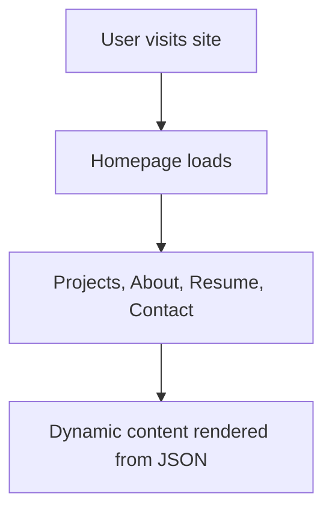

# 💼 Personal Portfolio Website

A clean, modern personal website to showcase your projects, skills, and resume.

## 🌟 Features

* Minimal, responsive layout with light mode
* Resume and social media links

## 🧠 How It Works



## 📁 Project Structure

```bash
portfolio-website/
├── public/               # Static assets
├── src/
│   ├── components/       # Reusable UI components
│   ├── data/             # JSON data for projects, skills
│   ├── pages/            # React/Next.js/Vue pages
│   └── styles/           # Tailwind or CSS modules
├── .env                 # Environment variables
├── README.md            # Project documentation
└── package.json         # Dependencies and scripts
```

## 🚀 Getting Started

1. Clone the repository:

```bash
git clone https://github.com/Justmalhar/portfolio-website.git
cd portfolio-website
```

2. Install dependencies:

```bash
npm install
```

3. Start the development server:

```bash
npm run dev
```

4. Visit `http://localhost:3000` in your browser.

## 🧩 Customization

* Edit `src/data/projects.json` to add your projects
* Update `src/data/skills.json` and `about.tsx`
* Modify metadata in `src/pages/_document.tsx` for SEO
* Replace placeholder images in `public/`

## 🛠️ Requirements

* Node.js 16+
* npm or yarn
* Optional: Formspree / EmailJS credentials for contact form

## 🧪 Deployment

Deploy with any of the following:

* **Vercel:** Auto-deploy from GitHub
* **Netlify:** Connect your repo and deploy
* **GitHub Pages:** Export static files (if applicable)

## 📄 License

MIT

---
